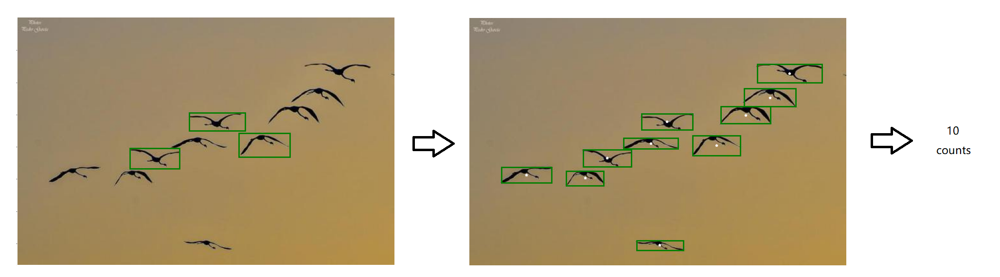

# count-anything
an empirical study on few-shot counting using segment anything (SAM)

## Install
Install python dependencies. We use conda and python 3.10.4 and PyTorch 1.13.1
> conda env create -f env.yaml

## Dataset preparation
- For FSC-147:
    Images can be downloaded from here: https://drive.google.com/file/d/1ymDYrGs9DSRicfZbSCDiOu0ikGDh5k6S/view?usp=sharing

- For coco val2017:
    Images can be downloaded from here: https://cocodataset.org/

## Test
Download the [ViT-H SAM model](https://dl.fbaipublicfiles.com/segment_anything/sam_vit_h_4b8939.pth)

- For FSC-147:
    > python test_FSC.py --data_path \<FSC-147 dataset path\> --model_path \<path to ViT-H SAM model\>

- For coco val2017:
    > python test_coco.py --data_path \<coco val2017 dataset path\> --model_path \<path to ViT-H SAM model\>

## Visualize
You can run [vis_FSC.ipynb](vis_FSC.ipynb) for FSC-147 or [vis_coco.ipynb](vis_coco.ipynb) for coco.

## Acknowledgement
We thank facebookresearch for their segment-anything model [[project]](https://github.com/facebookresearch/segment-anything), cvlab-stonybrook for their Learning To Count Everything [[project]](https://github.com/cvlab-stonybrook/LearningToCountEverything) and coco [[datasets]](https://cocodataset.org/).